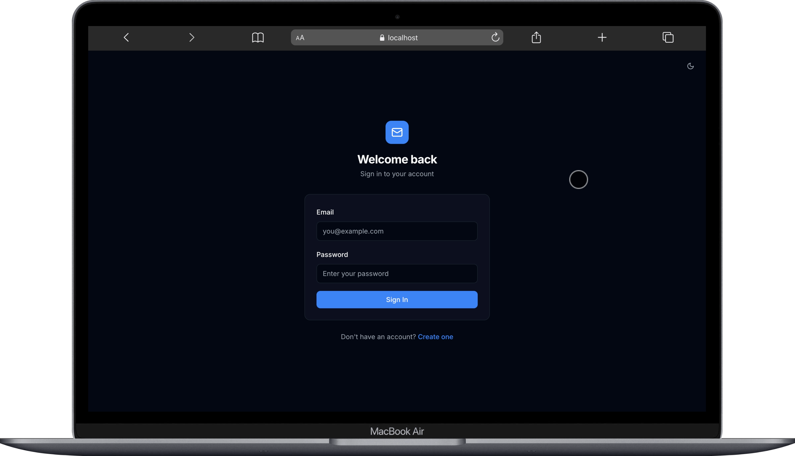
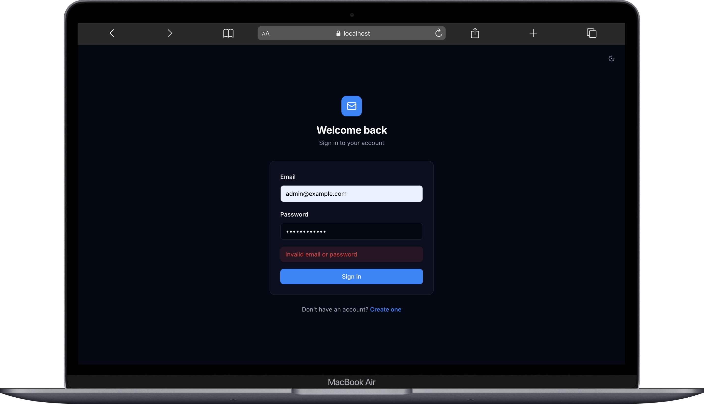
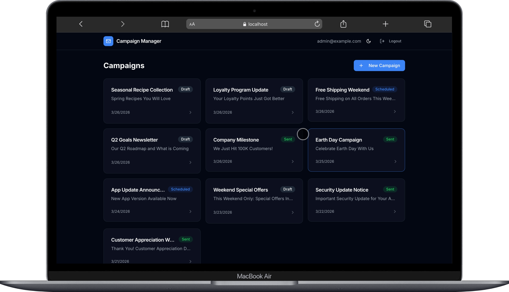
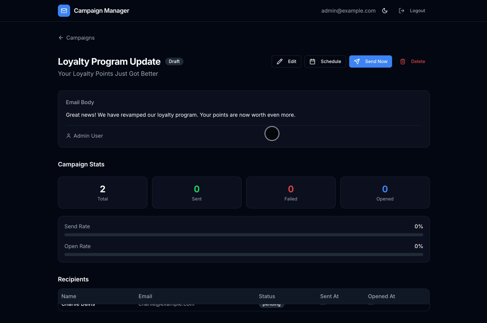
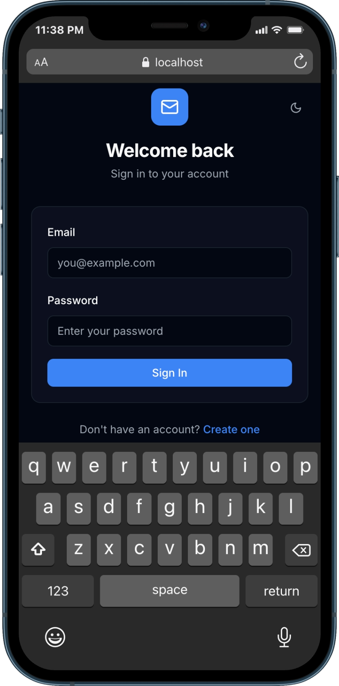
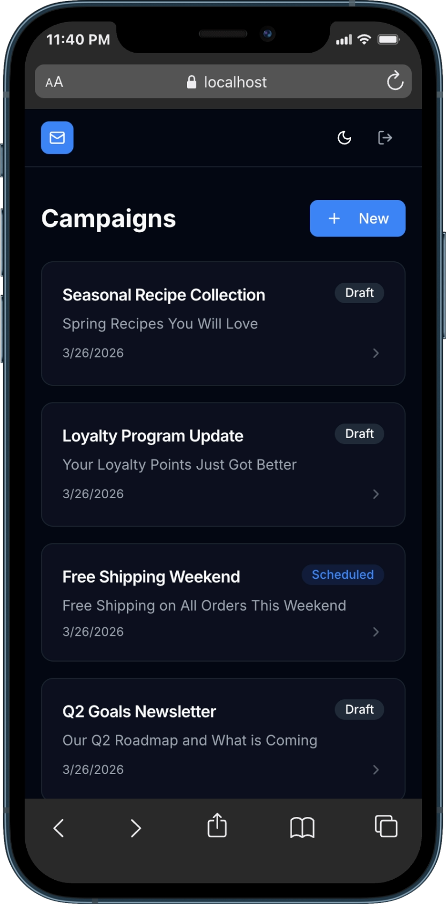
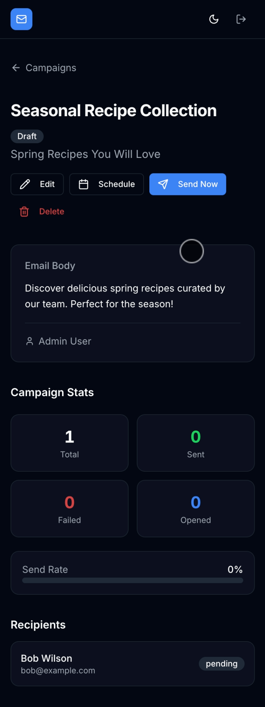

<p align="center">
  
  
  
  
  
  
</p>

<h1 align="center">Mini Campaign Manager</h1>

<p align="center">
  <i>A full-stack MarTech application for creating, managing, and tracking email campaigns — built with modern tooling and a clean, production-grade architecture.</i>
</p>

<br/>

## Screenshots

### Desktop

<p align="center">
  
  &nbsp;
  
</p>
<p align="center">
  <sub>Login Page</sub>
  &nbsp;&nbsp;&nbsp;&nbsp;&nbsp;&nbsp;&nbsp;&nbsp;&nbsp;&nbsp;&nbsp;&nbsp;&nbsp;&nbsp;&nbsp;&nbsp;&nbsp;&nbsp;&nbsp;&nbsp;&nbsp;&nbsp;&nbsp;&nbsp;&nbsp;&nbsp;&nbsp;&nbsp;&nbsp;&nbsp;&nbsp;&nbsp;&nbsp;&nbsp;&nbsp;&nbsp;&nbsp;&nbsp;&nbsp;&nbsp;&nbsp;&nbsp;&nbsp;&nbsp;&nbsp;
  <sub>Login — Validation Error</sub>
</p>

<p align="center">
  
  &nbsp;
  
</p>
<p align="center">
  <sub>Campaign List</sub>
  &nbsp;&nbsp;&nbsp;&nbsp;&nbsp;&nbsp;&nbsp;&nbsp;&nbsp;&nbsp;&nbsp;&nbsp;&nbsp;&nbsp;&nbsp;&nbsp;&nbsp;&nbsp;&nbsp;&nbsp;&nbsp;&nbsp;&nbsp;&nbsp;&nbsp;&nbsp;&nbsp;&nbsp;&nbsp;&nbsp;&nbsp;&nbsp;&nbsp;&nbsp;&nbsp;&nbsp;&nbsp;&nbsp;&nbsp;&nbsp;&nbsp;&nbsp;&nbsp;&nbsp;&nbsp;&nbsp;&nbsp;&nbsp;
  <sub>Campaign Detail</sub>
</p>

### Mobile

<p align="center">
  
  &nbsp;&nbsp;
  
  &nbsp;&nbsp;
  
</p>
<p align="center">
  <sub>Login</sub>
  &nbsp;&nbsp;&nbsp;&nbsp;&nbsp;&nbsp;&nbsp;&nbsp;&nbsp;&nbsp;&nbsp;&nbsp;&nbsp;&nbsp;&nbsp;&nbsp;&nbsp;&nbsp;&nbsp;&nbsp;&nbsp;&nbsp;&nbsp;&nbsp;&nbsp;&nbsp;&nbsp;&nbsp;&nbsp;&nbsp;
  <sub>Campaign List</sub>
  &nbsp;&nbsp;&nbsp;&nbsp;&nbsp;&nbsp;&nbsp;&nbsp;&nbsp;&nbsp;&nbsp;&nbsp;&nbsp;&nbsp;&nbsp;&nbsp;&nbsp;&nbsp;&nbsp;&nbsp;&nbsp;&nbsp;&nbsp;&nbsp;
  <sub>Campaign Detail</sub>
</p>

---

## Tech Stack

<table align="center">
<thead>
<tr><th>Layer</th><th>Technology</th></tr>
</thead>
<tbody>
<tr><td><b>Monorepo</b></td><td>Yarn Workspaces</td></tr>
<tr><td><b>Backend</b></td><td>Node.js + Express + TypeScript</td></tr>
<tr><td><b>Database</b></td><td>PostgreSQL 16 + Sequelize v6</td></tr>
<tr><td><b>Auth</b></td><td>JWT + bcryptjs</td></tr>
<tr><td><b>Validation</b></td><td>Zod</td></tr>
<tr><td><b>Frontend</b></td><td>React 19 + TypeScript + Vite</td></tr>
<tr><td><b>Styling</b></td><td>Tailwind CSS v3 + shadcn/ui</td></tr>
<tr><td><b>State</b></td><td>Zustand (auth) + TanStack React Query (server state)</td></tr>
<tr><td><b>Testing</b></td><td>Jest + supertest</td></tr>
<tr><td><b>DX</b></td><td>Prettier + ESLint + Husky + lint-staged</td></tr>
</tbody>
</table>

---

## Getting Started

### Option 1 — Docker (Recommended)

```bash
# Start all services (PostgreSQL, Backend, Frontend)
docker compose up

# If you've made code changes, rebuild first:
docker compose up --build
```

Once running:

| Service  | URL                     |
|----------|-------------------------|
| Frontend | http://localhost:5173   |
| Backend  | http://localhost:3001   |

### Option 2 — Manual Setup

**Prerequisites:** Node.js 22+, Yarn 1.x, Docker (for PostgreSQL)

```bash
# 1. Start PostgreSQL via Docker
docker compose up postgres -d

# 2. Install dependencies
yarn install

# 3. Set up environment variables
cp .env.example .env

# 4. Run migrations & seed demo data
yarn db:migrate
yarn db:seed

# 5. Start development servers
yarn dev
```

> **Note:** Docker Compose maps PostgreSQL to host port **5433** (not 5432) to avoid conflicts with any local PostgreSQL instance.

### Running Tests

```bash
# Create the test database (Docker PostgreSQL on port 5433)
createdb -h localhost -p 5433 -U campaign_user campaign_manager_test
# Password: campaign_pass

# Run tests
yarn test
```

---

## Demo Credentials

After seeding, log in with either account:

| Email                  | Password      |
|------------------------|---------------|
| admin@example.com      | password123   |
| marketer@example.com   | password123   |

---

## Architecture

```
Request → Routes → Zod Validation → Controller → Service → Sequelize Model → PostgreSQL
```

Each layer has a single responsibility:

- **Routes** — HTTP method + path, attach middleware, delegate to controller
- **Controllers** — Parse request, call service, format HTTP response
- **Services** — Pure business logic, no `req`/`res` access, independently testable
- **Models** — Sequelize class-based definitions with associations

---

## API Reference

### Authentication

| Method | Endpoint          | Auth | Description            |
|--------|-------------------|------|------------------------|
| POST   | `/auth/register`  | No   | Register a new user    |
| POST   | `/auth/login`     | No   | Login, returns JWT     |

### Campaigns

| Method | Endpoint                     | Auth | Description              |
|--------|------------------------------|------|--------------------------|
| GET    | `/campaigns`                 | Yes  | List campaigns (paginated) |
| POST   | `/campaigns`                 | Yes  | Create campaign          |
| GET    | `/campaigns/:id`             | Yes  | Campaign details + stats |
| PATCH  | `/campaigns/:id`             | Yes  | Update draft campaign    |
| DELETE | `/campaigns/:id`             | Yes  | Delete draft campaign    |
| POST   | `/campaigns/:id/schedule`    | Yes  | Schedule a campaign      |
| POST   | `/campaigns/:id/send`        | Yes  | Send a campaign          |

### Recipients

| Method | Endpoint        | Auth | Description           |
|--------|-----------------|------|-----------------------|
| GET    | `/recipients`   | Yes  | List all recipients   |
| POST   | `/recipient`    | Yes  | Create a recipient    |

---

## Database Schema

```
┌──────────┐       ┌──────────────┐       ┌──────────────────────┐       ┌──────────────┐
│  users   │       │  campaigns   │       │ campaign_recipients  │       │  recipients  │
├──────────┤       ├──────────────┤       ├──────────────────────┤       ├──────────────┤
│ id       │◄──┐   │ id           │◄──────│ campaign_id (PK)     │       │ id           │
│ email    │   └───│ created_by   │       │ recipient_id (PK) ───┼──────►│ email        │
│ name     │       │ name         │       │ sent_at              │       │ name         │
│ password │       │ subject      │       │ opened_at            │       │ created_at   │
│ created_at│      │ body         │       │ status               │       └──────────────┘
└──────────┘       │ status       │       └──────────────────────┘
                   │ scheduled_at │
                   │ created_at   │
                   │ updated_at   │
                   └──────────────┘

Status values:  draft → scheduled → sending → sent
Recipient status: pending | sent | failed
```

---

## Business Rules

| # | Rule |
|---|------|
| 1 | A campaign can only be edited or deleted when its status is `draft` |
| 2 | `scheduled_at` must be a future timestamp |
| 3 | Sending transitions status to `sent` and cannot be undone |
| 4 | Sending simulates async delivery: 85% success rate with random delays |

---

## Project Structure

```
campaign-manager/
├── packages/
│   ├── backend/                # Express API + Sequelize
│   │   ├── src/
│   │   │   ├── config/         # DB, JWT, env config
│   │   │   ├── controllers/    # HTTP request handlers
│   │   │   ├── middleware/     # Auth, validation, errors
│   │   │   ├── migrations/    # Database migrations (plain JS)
│   │   │   ├── models/        # Sequelize models + associations
│   │   │   ├── routes/        # Express routers
│   │   │   ├── seeders/       # Demo data
│   │   │   ├── services/      # Business logic
│   │   │   ├── validators/    # Zod schemas
│   │   │   └── utils/         # Helpers (stats)
│   │   └── tests/             # Jest + supertest
│   └── frontend/              # React 19 + Vite
│       └── src/
│           ├── api/           # Axios client + endpoint functions
│           ├── components/    # UI components (layout, campaigns, ui)
│           ├── hooks/         # React Query hooks
│           ├── pages/         # Route pages
│           ├── store/         # Zustand auth store
│           └── types/         # TypeScript interfaces
├── docker-compose.yml
└── package.json               # Yarn workspace root
```

---

## Available Scripts

```bash
yarn dev                # Start both backend + frontend
yarn dev:backend        # Backend only (port 3001)
yarn dev:frontend       # Frontend only (port 5173)
yarn test               # Run all backend tests
yarn test:watch         # Tests in watch mode
yarn db:migrate         # Run migrations
yarn db:seed            # Seed demo data
yarn db:reset           # Full reset: undo → migrate → seed
yarn lint               # ESLint fix
yarn format             # Prettier write
yarn typecheck          # TypeScript check both packages
yarn docker:start       # docker compose up
yarn docker:build       # docker compose up --build
yarn docker:stop        # docker compose down
```

---

## Building with Claude Code: A Practical Case Study

<blockquote>

This project was built with the assistance of <a href="https://docs.anthropic.com/en/docs/claude-code/overview">Claude Code</a>, Anthropic's agentic coding tool. The following is an honest account of where AI-assisted development worked well, where it fell short, and the principles that guided my decisions on what to delegate versus what to retain as human responsibility.

</blockquote>

### What Claude Code Did Well

Claude Code proved most effective at high-volume, pattern-consistent work — the kind of tasks where the structure is well-defined and the risk of a subtle mistake is low relative to the time saved.

1. **Project scaffolding.** Claude Code generated the entire monorepo structure: `package.json` configurations, Docker Compose setup, Prettier/ESLint/Husky toolchain, and the layered backend architecture (routes, controllers, services, models). This kind of boilerplate is time-consuming to write by hand yet follows well-established patterns — an ideal fit for AI generation.

2. **Backend implementation.** All Sequelize models, database migrations, Express routes, controllers, services, authentication middleware, Zod validation schemas, and test suites were generated by Claude Code. The layered architecture kept each generated file focused and testable.

3. **Frontend component generation.** Claude Code produced shadcn/ui-compatible components (buttons, cards, badges, inputs, dialogs) without requiring `@radix-ui` as a dependency, along with React Query hooks, Zustand stores, and all page-level components. The output followed consistent patterns across files.

4. **UI redesign.** A complete visual overhaul was delegated to Claude Code: a dark/light mode system using CSS custom properties, the Inter typeface, a refreshed color palette, responsive mobile layouts, entrance animations, and polished component styles. The prompt that initiated this was deliberately vague ("*make it clean and smooth like all the funded YC companies*"), and Claude Code translated that aesthetic direction into concrete implementation.

5. **Debugging infrastructure issues.** Claude Code diagnosed and resolved Docker port conflicts, a Sequelize initialization error caused by file naming, and stale React Query cache behavior across user sessions.

### Prompts Used and Their Outcomes

The following prompts were used during development. Each demonstrates a different mode of interaction with Claude Code — from high-level design direction to targeted bug reports.

<table>
<thead>
<tr><th width="40%">Prompt</th><th width="60%">Outcome</th></tr>
</thead>
<tbody>
<tr>
<td>

> *"Redesign the frontend UI to match the visual quality of modern YC-funded SaaS products. Focus on a clean, polished aesthetic with smooth interactions. The first impression when a user accesses the system should feel premium."*

</td>
<td>

Claude Code delivered a comprehensive UI overhaul: a new color system with light/dark CSS custom properties, the Inter typeface, a theme toggle (light/dark/system), redesigned page layouts with entrance animations, responsive mobile breakpoints, and polished component styles across buttons, cards, and badges.

</td>
</tr>
<tr>
<td>

> *"After logging in with a different account, the campaign list still displays data from the previous session. The list does not refresh to reflect the new user's campaigns."*

</td>
<td>

Claude Code identified the root cause: TanStack React Query's in-memory cache was persisting across user sessions. The fix was adding `queryClient.clear()` calls on login, register, and logout — ensuring a clean data state on every authentication event.

</td>
</tr>
<tr>
<td>

> *"The application is throwing a `No Sequelize instance passed` error at runtime. This started after the initial project scaffolding — no configuration changes were made."*

</td>
<td>

Claude Code traced the import chain and discovered that `database.js` (the sequelize-cli config) and `database.ts` (the Sequelize instance) coexisted in the same directory. Node's CommonJS resolver was picking the `.js` file over `.ts`, causing the wrong module to load. The fix was renaming the CLI config to `database.config.js`.

</td>
</tr>
</tbody>
</table>

### Where Claude Code Was Wrong

No AI tool is infallible, and transparency about failures is as important as documenting successes.

1. **The Sequelize naming conflict** — Claude Code itself placed `database.js` alongside `database.ts` in the `config/` directory during initial scaffolding. The resulting runtime error (`No Sequelize instance passed`) required multiple debugging rounds, including manual `console.log` instrumentation, before Claude Code identified the root cause. This is a category of bug — build tooling and module resolution edge cases — where AI tools often lack the contextual awareness that a human developer with Node.js experience would have.

2. **Missing delete button** — The delete button was rendered inside a `draft`-status-only conditional block, making it invisible for sent and scheduled campaigns. Claude Code did not catch this usability issue on its own; I had to explicitly report that the button was missing before it was moved outside the conditional and the corresponding backend restriction was relaxed.

3. **Stale cache across user sessions** — React Query's cache persisted between different user logins, displaying the previous user's campaign data. This multi-user scenario was not anticipated during initial implementation. The fix was straightforward once the bug was reported, but the oversight highlights that AI-generated code may not account for all real-world usage patterns.

### What I Chose to Retain as Human Responsibility

Working with an AI coding assistant does not mean delegating judgment. The following decisions were deliberately kept under human control:

1. **Architecture decisions.** I reviewed and approved the layered architecture pattern and the database schema design — including index placement, foreign key constraints, and cascade rules — before allowing Claude Code to implement them. Architectural decisions have long-term consequences that require understanding the full system context.

2. **Security-sensitive code.** JWT secret handling, password hashing configuration, authentication middleware logic, and the Axios 401-interceptor auto-logout behavior were all manually verified. Security code demands human scrutiny because the cost of a subtle error is disproportionately high.

3. **Business rule changes.** When Claude Code suggested removing the draft-only restriction on campaign deletion, I evaluated the implications before approving the change. State machine transitions (`draft` → `scheduled` → `sending` → `sent`) encode business logic that should be modified with intentionality, not convenience.

4. **Infrastructure configuration.** Docker port mappings, environment variable structures, and database connection strings were reviewed rather than accepted at face value. This proved important when the default PostgreSQL port 5432 conflicted with a local instance, requiring a deliberate change to port 5433.

### Key Takeaways

| Insight | Detail |
|---------|--------|
| **AI excels at pattern-consistent, high-volume work** | Scaffolding, CRUD endpoints, component boilerplate, and style implementation are ideal delegation targets. |
| **AI struggles with emergent complexity** | Module resolution edge cases, multi-user state management, and conditional rendering that requires understanding user intent often need human intervention. |
| **The human role is to set boundaries and verify** | The most productive workflow was: define the architecture, delegate the implementation, review the output, and own the debugging when things went wrong. |
| **Clear prompts yield better results** | Providing specific context about the problem and the desired outcome consistently produced more accurate and targeted solutions. |

---

<p align="center">
  <sub>Built for educational and demonstration purposes.</sub>
</p>
